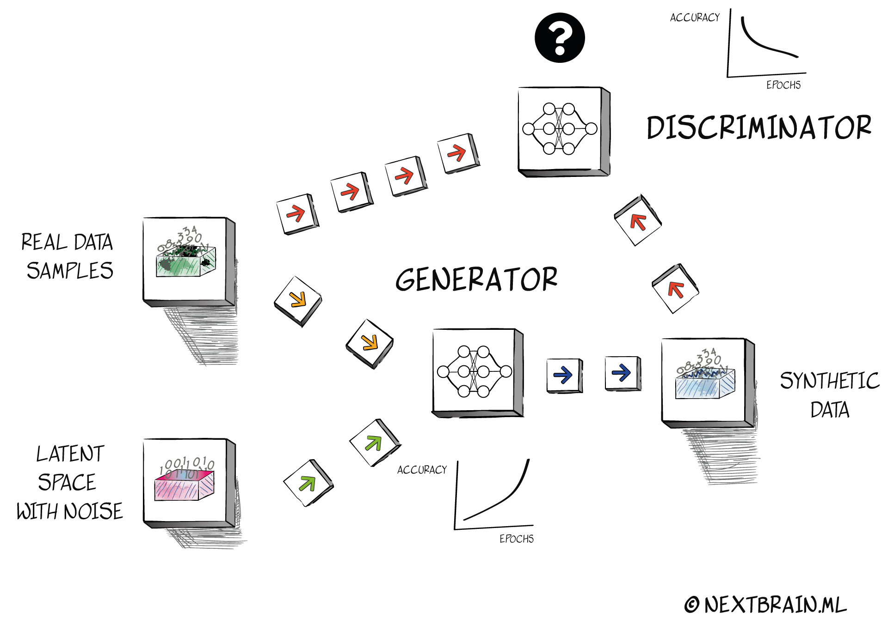

# **NB synthetic**
A Simple and robust unsupervised synthetic data generator.

License: MIT

Development Status: Beta

Homepage: [https://github.com/NextBrain-ml/tabular-synthetic-data/]

## **Overview**
Next Brain Synthetic is a straightforward but robust tabular synthetic data generating package. In images generation or speech generation applications, synthetic data generation is in a golden era. Since Ian J. Goodfellow introduced Generative Adversarial Networks in 2014 [1], this algorithm has become key in data generation, outperforming existing ones such as Variational Autoencoders and Boltzman Machines. GANs are one of the most versatile neural network architectures currently in use.
   GANs are made up of two parts generators and discriminators. The generator model generates synthetic samples from random noise collected using a distribution, which are then provided to the discriminator, which tries to discern between the two. Both the generator and the discriminator enhance their capabilities until the discriminator can no longer distinguish between real and synthetic samples. Training generator and discriminator models at the same time is generally unstable[^2]. Since its introduction, multiple variations of GAN have been developed to improve both its stability and accuracy. For example, with the addition of new parameters as an extra condition, the discriminator has an additional aid in classifying actual and fake data. This case is known as Conditional GAN or CGAN, and it uses an additional 'condition' to switch the method from 'unsupervised learning' to 'supervised learning'. Another example is the Auxilary Classifier GAN, or ACGAN, is another CGAN version. The list of improved GANs that have been widely utilized in image generation applications is considerable.

   
## **Why a basic library for synthetic tabular data generation?**

   When it comes to tabular data, GAN's journey has evolved quietly in contrast to image[^3,^4], video[^5], and speech[^6] generation. There are few libraries for creating synthetic tabular data, and they are generally based on conditional GAN architectures[^6][^7][^8]. Tabular data, on the other hand, is by far the most frequent data resource in the world (there are about 700 Millions of active spreadsheets users worldwide). Furthermore, the majority of possible data applications in many industries typically rely on limited datasets and 'low quality' data, as Data Scientists refer to it. This is why, in a data-centric approach[^9], the development of tools for this type of data is critical. As an example, we are helping a large hospital in Spain's psychiatric department in a data analysis project. They came to us with a comprehensive research based on data collected over the last ten years. Psychiatric hospitalizations are critical, and this research began with the goal of improving early alerts and prevention protocols. We got the results in the form of a spreadsheet with 38 columns and 300 rows. Certainly, that is a small amount of data for any data scientist, and even less for a statistician. It was, however, a challenging effort for them to collect this data. ¿What were we going to say to them?. ¿Should we tell them that this data is insufficient for using Machine Learning?. Indeed, with this data, the validity of any statistical method will be questioned. However, this should not be an impediment to help them maximizing the value from this effort obtaining actionable insights that may be valuable.
   Available packages for generated syntehtic data relies on CGAN architectures. When we have serval dimensions in the original datasets, we have to choose one as an additional 'condition' for our GAN. We will use this dimension or features to condition the generation of the other features. This is certainly practical when we want to use the dataset to solve a supervised learning problem as for example classification or regression. Then we can use our target variable as condition for the GAN. But it's common that this small datasets has not a single target. Users wants to get actionable insights from different features. So, to ask these users for a 'target' feature is something unreallistic. 

## **Unconditional GANs for tabular data**

   As we mentioned, the evolution of GANs has brought interesting ideas as introducing extra information to the discriminator in order to get better accuracy and give more stability to the net. This variant method requires from a target that will condition the generated synthetic data.  If this target data hasn't enough quality (something that's common) we are adding an important bias to our new generated data. Moreover, as we said, many datasets has not a single target feature, because users wants to make predicitions on different features in order to get more insights. So, to condition the synthetic data to a single feature will also add a bias in the generated data. This is why we have decided to use a non conditional GAN or non supervised GAN (also called vanilla GAN) and treat the synthetic data generation as an unsupervised learning problem. Probably the accuracy we get could be improved by condition the GAN with a reliable target variable, but we wanted to provide a versatile tool for this specific target: 700M active spreadsheets users with small or medium data sets with poor data quality. 
  
## **Statistical tests**
   For checking the output accuracy we have to compare the original input data with the obtained synthetic data. So we have to address the problem of comparing samples from two probability distributions. There are different satatistical tests available for that purpose as the Student's t-test or the Wilcoxon signed-rank test (a nonparametric version of the paired Student’s t-test). For numerical features we also implement the Kolmogorov-Smirnov test. All the above test compartes one-to-one the probability distributions of each feature in the input dataset and the synthetic data (called two samples test or homogeneity problem). But we also needed a test that was able to compare the similarity of both input/outup complete datasets. We have choosen a quite novel approach: the Maximum Mean Discrepancy (MMD) measurement. MMD is a statistical tests to determine if two samples are from different distributions. This test measures the distance between the means of the two samples, mapped into a reproducing kernel Hilbert space (RKHS). Maximum Mean Discrepancy has found numerous applications in machine learning and nonparametric testing [^10][^11]. MMD tests whether distributions p and q are different on the basis of samples drawn from each of them, by finding a smooth function which is large on the points drawn from p, and small on the points from q. The core test statistic is the difference between the mean function values of the two samples; when this is large, the samples are likely from different distributions. An additional reason why we have choosen this test is because it works well with low sample size data.


## **Limitations**
   Unsupervised GANs have been known to be unstable to train and often resulting in generators that produce unrealistic outputs. Some posible solutions have been adopting deep convolutional generative adversarial networks [^12]. But our target with this library are small and medium size datasets, so we have design a network architecture that is robust generating syntehtic datasets (also called fake datasets, but we don't like this word much) up to 5.000 instances. We have tested input datasets with the same number of instances and the newtork is stable with a very affordable computational cost. The library works with both, numerical and categorical inputs. Concerning the data dimnesionality, nbsynthetic have been tested with datasets up to 200 dimensions. A limitation emerged from the test is when input data is highly dimensional and with only numerical features. As a general rule, performance is better when we have a dataset with mixed numerical and categorical features.   

# **Requirements**
nbsynthetic has been developed and runs on Python 3.8.

# **Installation**
pip install nbsynthetic

# **How to use it**

## **1. Input data**
  The first step is to load the data wich we will use to fit GAN. We can do it by importing the `nbsynthetic.data.load_data` function an use the parameters name of filename and decimal character. For example `df = input_data(filename, decimal='.')` . Once imported we have to prepare this data considering the following conditions.</br>
- nbsynthetic does not accept string values. We have to encode categorical featires with strings as a numeric array. We can use any of the encoders available in `sklearn.preprocessing`.
- We have to be sure that datatypes are correctly set. Numerical columns has to will have 'float' or 'int' dtypes. Boolean columns will be pandas Categorical type. 
- Drop or replace NaN values
- nbsynthetic does not accept Datetime columns. We have the option to remove it or transform into categorical features. nbsynthetic contain a module that makes this transformation: `data.data_preparation.manage_datetime_columns`, where the arguments are the dataframe and datetime column's name.

nbsyntehtic includes a module that can do all these transformations: `nbsynthetic.data_transformation.SmartBrain`:
- Correcty assigns datatypes and removes id columns
- Remove columns with a high number of NaN values, replaces NaN values when is possible, and discards the rest of the instances where replacement was not possible.
- Finally, this module is able to augment the dataset when possible id dataset lenght is too short. 

An example of how to do make this steps with nbsynthetic library:
   ```python
   from data import input_data
   from data_preparation import SmartBrain

   df = input_data('file_name', decimal=',')
   SB = SmartBrain() 
   df = SB.nbPreparation(df)
   ```
  
## **2. Create a GAN instance**
   ```python
   from vgan import GAN
   ```

The arguments for the GAN instance are:
- GAN : Vanilla GAN
- df : input data
- samples:number of instances in the synthetic dataset <br/>
We have also additional parameters we can change in the GAN (it's not recomended, by the way).
- initial_lr (default value = 0.0002): Initial learning rate. For more information go [here](https://keras.io/api/optimizers/).
- dropout (default value = 0.5). Droput value. For more information go [here](https://keras.io/api/layers/).
- epochs (default value = 10). Number of epochs. For more information go [here](https://keras.io/api/models/model_training_apis/).

## **3. Generate a synthetic dataset**

   Then, we can directly create a synthetic dataset with the desired number of instances or samples. 
   ```python
   from synthetic import synthetic_data

   samples= 2000 #number of samples we want to generate
   newdf = synthetic_data(
       GAN, 
       df, 
       samples = samples
       )
   ```
## **4. Statistical tests**
   The last step is to check how similar is the synthetic dataset with the input one. We will apply several statistical test as explined before. The most important one is the the Maximum Mean Discrepancy test (MMD).
  ```python
  from statistical_tests import mmd_rbf, Wilcoxon, Student_t, Kolmogorov_Smirnov
  
  """
  MMD is a statistical tests to determine if two samples 
  are from different distributions. This statistic test 
  measures the distance between the means of the two samples 
  mapped into a reproducing kernel Hilbert space (RKHS).
  Maximum Mean Discrepancy has found numerous applications in 
  machine learning and nonparametric testing.

      Args:

         X: ndarray of shape (n_samples_X, n_features)
         Y: ndarray of shape (n_samples_Y, n_features)
         gamma: float (default:None)

      Returns:
          Maximum Mean Discrepancy (MMD) value: float
   """
   mmd_rbf(df, newdf, gamma=None)
  ```
   Additionaly , we can plot each feature's histograms comparing  both, original and synthetic distributions. We use [Plotly Open Source Graphing Library for Python](https://plotly.com/python/).

   ```python
   """ 
       Plot histograms
       Visually compare the distribution plots
       of each feature and shows the Wilcoxon 
       test values. Use as probability density
       as histnorm.

         Args:

             X: pd.DataFrame of shape(n_samples_X, n_features)
             Y: pd.DataFrame of shape (n_samples_Y, n_features)

         Returns:
             Plotly figure
   """
   plot_histograms(df, newdf)
   ```
   
# **References**
[^1]: Goodfellow, I., Pouget-Abadie, J., Mirza, M., Xu, B., Warde-Farley, D., Ozair, S., ... & Bengio, Y. (2014). Generative adversarial nets. Advances in neural information processing systems, 27.
[^2]: Arjovsky, M., & Bottou, L. (2017). Towards principled methods for training generative adversarial networks. arXiv preprint arXiv:1701.04862.
[^3]: Karras, T., Laine, S., Aittala, M., Hellsten, J., Lehtinen, J., & Aila, T. (2020). Analyzing and improving the image quality of stylegan. In Proceedings of the IEEE/CVF conference on computer vision and pattern recognition (pp. 8110-8119).
[^4]: Clark, A., Donahue, J., & Simonyan, K. (2019). Adversarial video generation on complex datasets. arXiv preprint arXiv:1907.06571.
[^5]:Binkowski, M., Donahue, J., Dieleman, S., Clark, A., Elsen, E., Casagrande, N., ... & Simonyan, K. (2019). High fidelity speech synthesis with adversarial networks. arXiv preprint arXiv:1909.11646.
[^6]: Xu, L., Skoularidou, M., Cuesta-Infante, A., & Veeramachaneni, K. (2019). Modeling tabular data using conditional gan. Advances in Neural Information Processing Systems, 32.
[^7]: Mirza, M., & Osindero, S. (2014). Conditional generative adversarial nets. arXiv preprint arXiv:1411.1784.
[^8]: Lei Xu LIDS, Kalyan Veeramachaneni. (2018). Synthesizing Tabular Data using Generative Adversarial Networks. arXiv:1811.11264v1
[^9]: Motamedi, M., Sakharnykh, N., & Kaldewey, T. (2021). A data-centric approach for training deep neural networks with less data. arXiv preprint arXiv:2110.03613.
[^10]: Ilya Tolstikhin, Bharath K. Sriperumbudur, and Bernhard Schölkopf (2016). Minimax estimation of maximum mean discrepancy with radial kernels. In Proceedings of the 30th International Conference on Neural Information Processing Systems (NIPS'16). Curran Associates Inc., Red Hook, NY, USA, 1938–1946.
[^11]: A. Gretton, K. M. Borgwardt, M. Rasch, B. Schölkopf, and A. Smola. (2007). A kernel method for the two sample problem. In B. Schölkopf, J. Platt, and T. Hoffman, editors, Advances in Neural Information Processing Systems 19, pages 513–520, Cambridge, MA. MIT Press.
[^12]: Radford, A., Metz, L., & Chintala, S. (2015). Unsupervised representation learning with deep convolutional generative adversarial networks. arXiv preprint arXiv:1511.06434.
